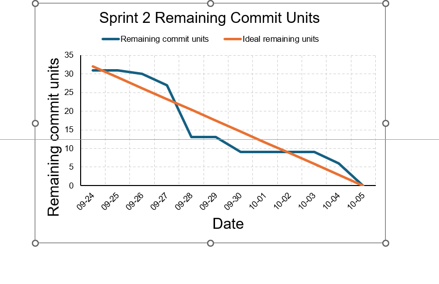

# Sprint 2 Reflection

## Sprint outcome

Our team produced a playable MonoGame demonstration with player movement, jumping, transformation, animation, damage, and shooting. We also implemented blocks, items, projectiles, enemy cycling, and several enemies with different movement behaviors. Interfaces, commands, factories, sprites, and states helped us keep these features separate from the main game loop. Some projectile interactions and the final integrated game still need more testing.

## Burndown discussion

The burndown chart has large drops on September 28 and near the deadline because team members worked locally for several days before committing completed features together. Work continued during the flat sections, but the commits were pushed later. Next sprint, we will commit smaller changes more regularly so the chart shows steadier progress.

## Team process

All six members contributed to the repository. Separate branches allowed members to work on the player, enemies, items, projectiles, sprites, and controls. The class structure made integration easier, but shared files such as `Player.cs`, `Game1.cs`, and `Content.mgcb` were changed on multiple branches. This increased the risk of merge conflicts. Some commit messages were also unclear, and delayed commits made progress look less consistent than it was.

## Next sprint

In the next sprint, we will create smaller tasks with clear owners and update their remaining-work estimates daily. Each member will commit a small working change at the end of a work session instead of waiting until a feature is complete. We will merge branches earlier, use clearer commit messages, complete code reviews before final integration, and reserve time for a full team playtest before the deadline.
